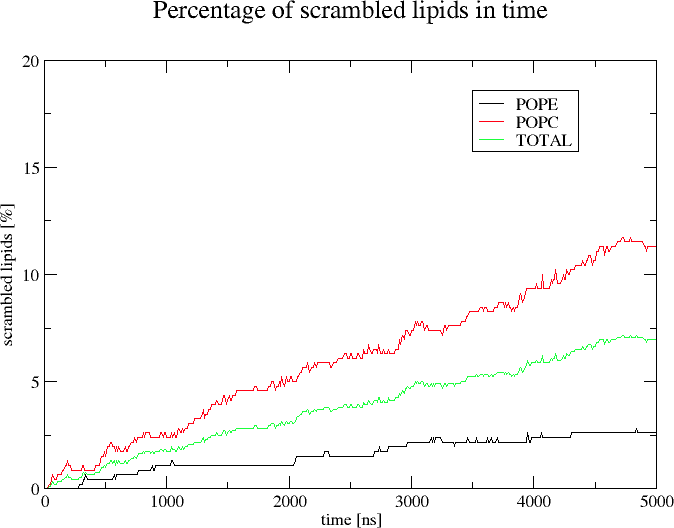

# scramblyzer: Toolbox For Analyzing Lipid Scrambling

`scramblyzer` consists of several modules (see their list using `scramblyzer -h`) performing various analyses connected to lipid scrambling (lipid flip-flops).

Module **composition** calculates lipid composition of a membrane (in time, if requested).

Module **positions** calculates position of each lipid head in time.

Module **rate** calculates the percentage of scrambled lipids in time.

Module **flipflops** calculates the number of flip-flop events that occured during the simulations.

## Dependencies

`scramblyzer` requires you to have groan library installed. You can get groan from [here](https://github.com/Ladme/groan). See also the [installation instructions](https://github.com/Ladme/groan#installing) for groan.

## Installation

1) Run `make groan=PATH_TO_GROAN` to create a binary file `scramblyzer` that you can place wherever you want. `PATH_TO_GROAN` is a path to the directory containing groan library (containing `groan.h` and `libgroan.a`).
2) (Optional) Run `make install` to copy the the binary file `scramblyzer` into `${HOME}/.local/bin`.

## Modules and general information

```
Usage: scramblyzer MODULE OPTIONS

MODULES
composition      calculates lipid composition of a membrane
positions        calculates position of each lipid head in time
rate             calculates percentage of scrambled lipids in time
flipflops        calculates the number of flip-flop events
```

Note that in all the modules, atoms can be selected using the [groan selection language](https://github.com/Ladme/groan#groan-selection-language).

As `scramblyzer` is primarily designed for the analysis of Martini simulations, it natively recognizes all standard (and some non-standard) Martini lipids (over 200 lipid types). You can also add your own lipids by supplying a file `lipids.txt` into the directory from which you call `scramblyzer`. In this file, `scramblyzer` expects one lipid type (residue name) per line. The maximal length of the lipid name is 4 characters. The `lipids.txt` file may contain comments initiated by `#`. The maximal length of each line is 1023 characters. 

You can also add any additional lipids directly into the `scramblyzer` code (by modifying the variable `default_lipid_names` in the function `read_lipid_names` located in the file `src/general.c`) and recompiling the program using `make groan=PATH_TO_GROAN`.

## Module: composition

### Options
```
Valid OPTIONS for the composition module:
-h               print this message and exit
-c STRING        gro file to read
-f STRING        xtc file to read (optional)
-n STRING        ndx file to read (optional, default: index.ndx)
-o STRING        output file name (default: composition.xvg)
-p STRING        selection of lipid head identifiers (default: name PO4)
-t FLOAT         time interval between analyzed trajectory frames in ns (default: 1.0)
```

Note that the options `-o` and `-t` are only used when `xtc` file is provided (flag `-f`). Otherwise the results are written to standard output (i.e. terminal).

### Example
```
scramblyzer composition -c md.gro
```

Scramblyzer will calculate lipid composition of a membrane based on the atoms and their coordinates from `md.gro`. Lipids will be assigned to the upper or lower leaflet based on the position of their 'lipid head identifiers' (in this case the selection `name PO4`, default option of the flag `-p`) relative to the center of all identified lipid atoms. Note that `scramblyzer` expects one 'lipid head identifier' atom per lipid molecule.

The output of this analysis for a POPC:DOPE:POPI membrane can look for example like this:

```
Lipid | Upper | Lower | Full 
DOPE  | 139   | 137   | 276  
POPI  | 69    | 68    | 137  
POPC  | 255   | 251   | 506  
-----------------------------
TOTAL | 463   | 456   | 919  
```

```
scramblyzer composition -c md.gro -f md.xtc -p "name PO4 PO1" -t 5
```

The program will calculate lipid composition of a membrane _in time_, based on the coordinates from `md.xtc` (the coordinates from `md.gro` will not be used). Lipids will be assigned to the upper or lower leaflet as described above and this assignment will be performed for every analyzed frame (in this case for trajectory frames every 5 ns, as set by the flag `-t`).

In this case, the 'lipid head identifiers' are defined as any atoms with the name `PO4` or `PO1`. Note that `scramblyzer` still assumes that there is only one 'lipid head identifier' atom per lipid molecule.

The output of this analysis will be written into `composition.xvg` (default option) and can be visualized using `xmgrace` (`xgmrace -nxy composition.xvg`).

## Module: positions

Gets the z-coordinate for each specified atom in each specified trajectory frame and writes it into an output file.

### Options
```
Valid OPTIONS for the positions module:
-h               print this message and exit
-c STRING        gro file to read
-f STRING        xtc file to read
-n STRING        ndx file to read (optional, default: index.ndx)
-o STRING        output file name (default: positions.xvg)
-p STRING        selection of lipid head identifiers (default: name PO4)
-t FLOAT         time interval between analyzed frames [in ns] (default: 1.0)
```

### Example
```
scramblyzer positions -c md.gro -f md.xtc -t 5
```

The program will get z-coordinates of all atoms with atom name `PO4` (default option of the flag `-p`) for frames every 5 ns (flag `-t`) and write these coordinates into `positions.xvg` (default option of the flag `-o`). The output file can be visualized using `xmgrace` (`xmgrace -nxy positions.xvg`).

## Module: rate

Module `rate` calculates the 'scrambling rate' for individual lipid types, i.e. how often the lipids flip between the membrane leaflets.

### How does it work

The program will first assign lipid molecules into their respective membrane leaflets (as with `scramblyzer composition`) based on their coordinates in the first frame of the `xtc` file. This assignment will be then treated as 'reference assignment'. In all further analyzed trajectory frames, lipid molecules will be assigned to the membrane leaflets again. Then, for each lipid, the current assignment of the lipid will be compared to the 'reference assignment'. In case the lipid is currently assigned to the opposite membrane leaflet than in the 'reference assignment', it is classified as 'scrambled'. For each analyzed trajectory frame, the proportion of 'scrambled lipids' is then calculated and written into the output file.

This approach to quantifying lipid scrambling has its advantages and disadvantages. It is quite robust and insensitive to user-defined parameters (unlike the approach used in the `flipflops` module) but it slightly underestimates the true number of scrambling events as any lipid that flips across the membrane an even number of times will be quantified as 'not scrambled'. When analyzing very long simulations of scramblases, the calculated 'scrambling rate' will eventually converge to 50% and then fluctuate around this value not increasing further despite the fact that the lipids will still be moving between the membrane leaflets.

### Options

```
Valid OPTIONS for the rate module:
-h               print this message and exit
-c STRING        gro file to read
-f STRING        xtc file to read
-n STRING        ndx file to read (optional, default: index.ndx)
-o STRING        output file name (default: rate.xvg)
-p STRING        selection of lipid head identifiers (default: name PO4)
-t FLOAT         time interval between analyzed trajectory frames in ns (default: 10.0)
```

### Example

```
scramblyzer rate -c md.gro -f md.xtc -o scrambling.xvg
```

The program will calculate scrambling rate for all known lipids based on the coordinates in `md.xtc` (the coordinates from `md.gro` will not be used). A trajectory frame will be analyzed every 10 ns (default option). The 'lipid head identifiers' are the atoms named `PO4` (default option) and `scramblyzer` expects one such atom per lipid molecule.

The scrambling rate will be calculated independently for every identified lipid type.

The output will be written into `scrambling.xvg` (flag `-o`) and can be visualized using `xmgrace` (`xmgrace -nxy scrambling.xvg`).

The plotted result for a POPC:POPE membrane containing a scramblase can look for example like this:


## Module: flipflops

Module `flipflops` calculates the number of flip-flop events during the simulation, distinguishing flips from the upper to the lower leaflet and in the opposite direction.

### How does it work

The program tracks the position of every lipid head relative to the membrane center in time. If the lipid head moves across the membrane center into the other leaflet, the number of flip-flop events is increased.

The problem with this approach to quantifying lipid scrambling is the difficulty of deciding whether a particular change in the position of the lipid can be characterized as a 'flip-flop event' or whether it is merely a fluctation in the position of the lipid that is currently translocating through the membrane. In other words, if we considered any movement of the lipid head from below the membrane center to above the membrane center to be a 'flip-flop event' then (depending on our temporal resolution) a single flip-flop event could actually be counted as multiple flip-flop events. This is because during the process of lipid flip-flop, the position of the lipid head tends to fluctuate and the head may cross the membrane center multiple times. Decreasing the temporal resolution of the analysis helps with this problem but it also brings an increased risk of _missing_ a flip-flop event that is 'real' but short-lived.

The `flipflops` module tries to tackle this challenge by introducing both `temporal limit` as well as `spatial limit` for the flip-flop events. For a flip-flop event to be counted by the program, the lipid head must move sufficiently far into the other membrane leaflet (`spatial limit`) and it must stay in this leaflet for a sufficiently long time (`temporal limit`). Still, deciding what values to use for these two options to obtain information about the number of 'real' flip-flop events may be difficult. The default values used by the `flipflops` module are by no means the only correct ones and they should _not_ be trusted blindly and without critical evaluation. It may be better to use the module `rate` for a scrambling rate quantification that is less sensitive to user-defined options.

### Options

```
Valid OPTIONS for the flipflops module:
-h               print this message and exit
-c STRING        gro file to read
-f STRING        xtc file to read
-n STRING        ndx file to read (optional, default: index.ndx)
-p STRING        selection of lipid head identifiers (default: name PO4)
-s FLOAT         how far into a leaflet must the head of the lipid move to count as flip-flop [in nm] (default: 1.5)
-t INTEGER       how long must the lipid stay in a leaflet to count as flip-flop [in ns] (default: 10)
```

### Example

```
scramblyzer flipflops -c md.gro -f md.xtc -s 1.75
```

The program will track the positions of 'lipid head identifiers' of all known lipids calculating the number of flip-flop events for these lipids based on the coordinates in `md.xtc` (the coordinates from `md.gro` will not be used). The 'lipid head identifiers' are the atoms named `PO4` (default option) and `scramblyzer` expects one such atom per lipid molecule.

A change in the position of the 'lipid head identifier' will only be counted as a flip-flop event if the 'lipid head identifier' moves at least 1.75 nm (on the z-axis) away from the geometric center of the membrane into the opposite membrane leaflet (flag `-s`) and then stays in this leaflet (above or below the geometric center of the membrane, respectively) for at least 10 ns (default option). 'Membrane' is defined as all atoms of all known lipids.

The flip-flop events will be calculated separately for the individual flip-flop directions and lipid types.

The output of this analysis for a POPC:POPE membrane containing a scramblase can look for example like this:
```
Lipid | U->L | L->U | All 
POPE  | 4    | 1    | 5   
POPC  | 10   | 9    | 19  
-----------------------------
TOTAL | 14   | 10   | 24  
```
`U->L` denotes the number of flip-flop events from the upper to the lower leaflet. `L->U` denotes the number of flip-flop events from the lower to the upper leaflet.


## Limitations

Assumes that the bilayer has been built in the xy-plane (i.e. the bilayer normal is oriented along the z-axis).

`scramblyzer` will NOT provide reliable results when applied to simulations with curved bilayers or vesicles.

Assumes that the simulation box is rectangular and that periodic boundary conditions are applied in all three dimensions.

Note that `scramblyzer` always uses center of _geometry_, not center of _mass_.

Only tested on Linux. Probably will not work on anything that is not UNIX-like.
